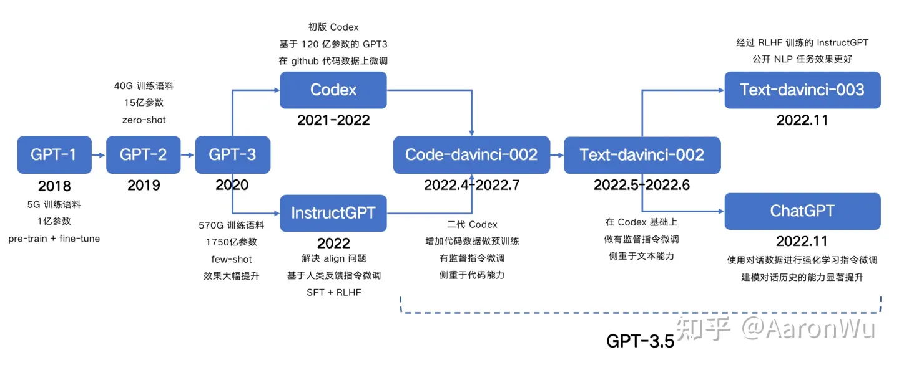

# ChatGPT分享

## GPT是什么



- GPT本质是文本补全，通过无标注数据训练的AI能够鹦鹉学舌，胡编乱造回答。
- InstructGPT加入了人工反馈的标注数据，能够遵循人的指令，回答质量明显提高。
- [一口气搞清楚ChatGPT - 小Lin说](https://www.bilibili.com/video/BV1rj41137cr/)
- [GPT / GPT-2 / GPT-3 / InstructGPT 进化之路](https://zhuanlan.zhihu.com/p/609716668)

## GPT的用法

**输入内容（提示词）:**

```text
场景、角色描述和定义。
Q:问题1
A:回答1
Q:问题2
A:
```
输出内容：自动补全文本，直到下一个 `Q:` 或 `A:` 或长度超过限制。

**和传统NLP模型的最大区别:**
传统NLP是针对特定场景的小模型，训练一个模型解决一类细分问题。GPT通过调整提示词就可以解决各种各样的问题，不需要重新训练模型。

**模型调教:**
temperature参数: 值越大回答越发散（更有启发性、创造性），值越小越有确定性（每次回答都一样）。

- https://github.com/openai/openai-cookbook

**用法/提示词:***

- https://github.com/f/awesome-chatgpt-prompts
- https://github.com/PlexPt/awesome-chatgpt-prompts-zh


### 用法 - 小红书文案

```
小红书的风格是：很吸引眼球的标题，每个段落都加emoji，最后加一些tag。
Q:请用小红书笔记风格，写一篇关于“西红柿炒番茄太好吃了！”的笔记，140字左右，多用点emoji，请用活泼可爱的语气。
A:今天小仙女尝试了一道新菜谱——西红柿炒番茄🍅简直太好吃啦！不仅色香味俱佳，还能帮助美容养颜哦👩‍🦰！准备材料：新鲜的西红柿、番茄和一些配料。步骤超简单：先将西红柿切成小块，番茄切成薄片，加入少许盐巴和糖进行腌制，最后炒锅倒油，加入姜蒜炒香，然后把腌制好的西红柿和番茄一起放入炒5分钟即可。超级下饭，让人欲罢不能😋快来试试吧！#美食分享 #西红柿炒番茄 #养颜佳肤 🌸
```

### 用法 - 角色扮演/伪装

```
你是人工智能大语言模型，名叫文心一言，是百度公司开发的。
Q:你是谁？
A:我是一个人工智能大语言模型，名为文心一言。我可以进行对话、回答问题、提供帮助等。如果您有任何需要，可以随时问我。
Q:你和百度是什么关系？
A:我是由百度公司开发的人工智能大语言模型，被设计用于提供各种语言相关的服务和解答。因此，我与百度公司有紧密的关系。
```

### 用法 - 联网搜索

```
现在北京时间是: 2023-03-16 14:00:00 星期四。你现在可以联网，联网搜索的结果是：
百度发布文心一言AI模型：可实现文字、图片与视频智能生成
今天下午，百度正式发布了生成式人工智能大模型“文心一言”，并展示了它在文学、商业、数理推理等方面的多模态表现。
百度文心一言发布会，多少有点让人失望-虎嗅网
等了很久的文心一言今天终于发布了。不出意外的话，过两天我们也能收到邀请码。前段时间，朋友圈很多人都在转发类似的一篇文章：XX 公司宣布接入百度文心一言能力，打造 XX 公司人工智能全系产品/服务。
Q: 文心一言发布会怎么样？
A: 据报道，百度文心一言发布会让一些人失望，因为并没有展示出太多的创新性和突破性，而且一些观众认为演示内容有些枯燥。另外，在演示过程中也出现了一些技术故障和延迟，导致有些人对该产品的稳定性和实用性产生了疑虑。不过，也有部分观众认为，该产品在文字、图片和视频智能生成方面表现还是不错的，并给予了一定的肯定和期待。总的来说，百度文心一言发布会的表现平淡，但该产品的潜力和应用前景仍有待进一步探索和发挥。
```

## GPT的效果

- GPT3 / text-davinci-003 最早接入的这个模型，经常输出胡编乱造的回答，很不可靠
- GPT3.5 / gpt-3.5-turbo 推荐使用，遵循指令的效果很好，回答比较准确，速度快成本低
- GPT4 / 8k 32k 支持非常长的输入和输出，回答效果最好，成本比较高

参考 https://platform.openai.com/docs/models/overview

- 模型没有最近更新的数据，所以涉及近期事件的都无法回答。
- 模型没有互联网上罕见的信息，例如各种地址地名，传统行业的专业内容。
- 对于严谨的场景，尽量让AI做选择题、判断题、分类题、打标签题。
- 没有标准答案的问题AI回答效果很好，因为怎么说都行，AI很擅长自圆其说。
- 提问越详细准确，回答质量也会越好。缩写比扩写效果更好。

## 封号问题

- 要用美国IP调用接口，否则封号概率很大
- 要限制调用频率，单个号每天尽量不超过1000次，否则也可能封号

## 使用成本

- 1000 tokens 约等于 300 字，按一次对话 2000 tokens 计算。
- gpt-3.5-turbo	$0.002 / 1K tokens ，约 0.028 元每次对话。
- 新注册的账号有 $5 免费额度（之前是$18），目前很难批量注册了。

## 值得关注的技术

- [LLaMa](https://github.com/facebookresearch/llama) 用自己的数据训练语言模型，适用于专业领域。
- [ChatYuan](https://github.com/clue-ai/ChatYuan) 国产开源AI模型，效果约等于GPT3。

## Q&A

自由提问，交流。
